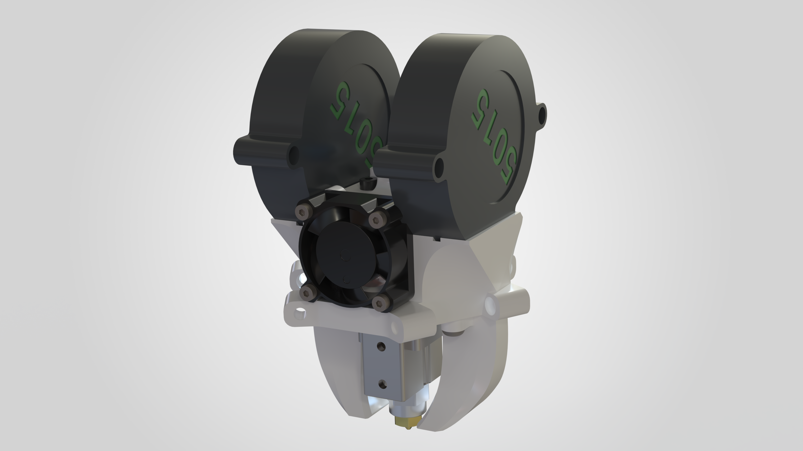

# Delta Flyer Effector

An effector for the Delta Flyer designed around the dragon hotends and dual 5015 part cooling

## Features

- Support for Dragon SF, HF, and Ace Volcano hotends
- Dual 5015 part cooling
- 2510 hotend fan
- ECAS Bowden fitting

## Requirements

- Dragon SF, HF, UHF or Ace Volcano hotend
- 2× 5015 blower fans
- 1× 2510 hotend fan
- ECAS fitting (4mm OD tube)
- Bowden extruder
- 4× M3 × 6mm BHCS
- 4× M2.5 × 12mm SHCS
- 4× M2 × 12mm SHCS
- Glue to hold the ECAS Fitting
